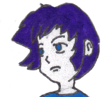

***

## GameEngine

Game development should feel less like building a house and feel more like drawing a comic book!

All you need to get started to create a `start.rb` file.

## How to install

**GameEngine** is not yet available for installation, but will be soon!

## How to use

At the most minimal just create a *start.rb* file and run `game` from the terminal.
You can also copy the `game` executable to your projects directory and double click
on it to run.

Example of a *start.rb*:

*Download the font used in this example:*
[mplus-1m-regular.ttf](https://github.com/stalbordboat/GameEngineDocs/blob/main/Fonts/mplus-1m-regular.ttf)

```ruby
# The Window is hidden by default.

Window.show

# Construct Text for a nice greeting!

text = Text.new('mplus-1m-regular.ttf', 'Hello, world!', 40)

# Center the Text

text.dest.x = Window.width  / 4.0
text.dest.y = Window.height / 3.5

# This loop will run the game until the loop is broken.

while true
  # Advance Game State

  break if Event.quit? || Event.trigger?(Event::Keyboard::Key::ESC)
  Event.update
  Renderer.update

  # Advance the text state each frame.

  text.color.r += 15
  text.color.g -= 5
  text.color.b += 5

  text.update

  # Render Graphics

  text.draw
  Renderer.draw
end
```

Then just run `game` in the terminal, or double click on `game` if you've placed it
in your projects directory.

## Credits

#### Music

File   - music.ogg

Artist - Daddy_s_Music

Song   - perfect-beauty
